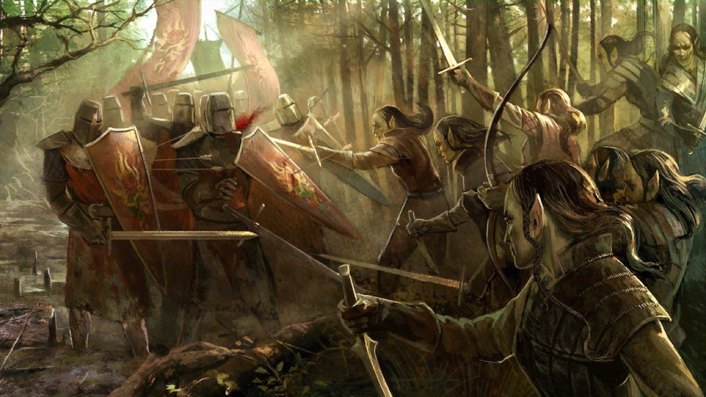
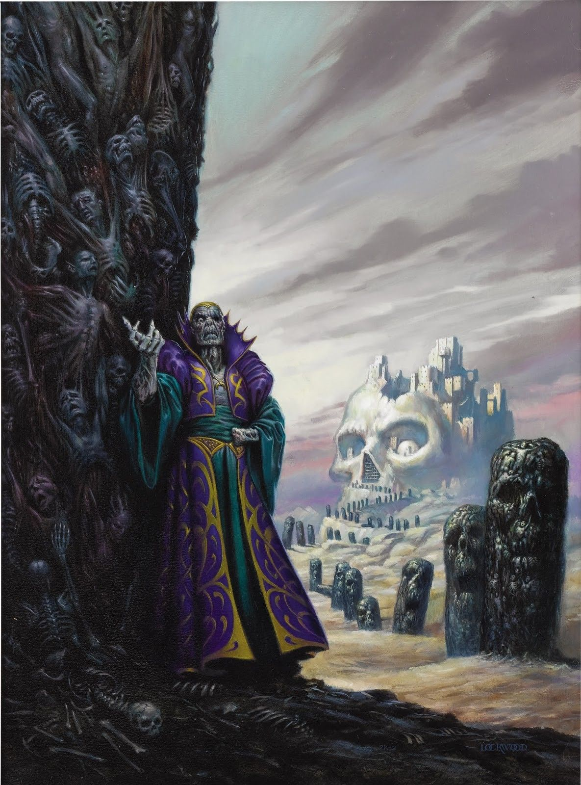
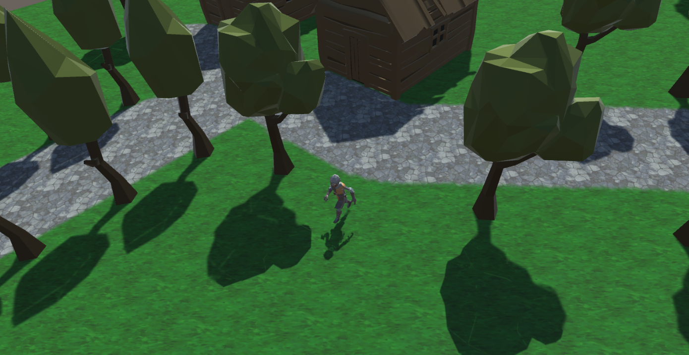
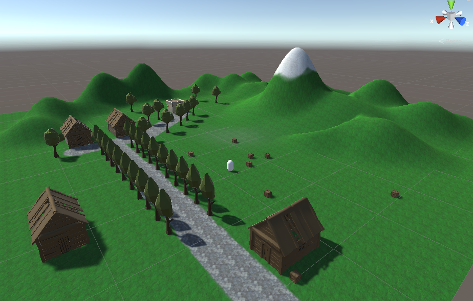

  <h1>Project “Dawn of wizardry” 1.5-Page GDD</h1>

In a long bloody battle that prophecies told, the light will prevail hence wisdom is gold.

- **Genre:** 3rd person action RPG, single player, fixed-camera.
- **Target Audience:** 13+ (T for Teen) fans of old school RPG's like Diablo or Torchlight.
- **Controls:** Mouse and keyboard.
- **Thematic Setting:** Medieval / Fantasy / Knights / Wizards.
- **Tech Stack:** Unity 2020.3.0f1, Asset store for 3D and UI.
- **Platform(s):** Steam.
- **MVP Game Moment:** 2 minutes of simple linear level flow with basic combar against 3 or 4 enemy types.

# Game Summary:
Project "Dawn of wizardry" is an ARPG, with lots of quests, that gives you a scence of discovery as you are in an open world finding quests along the way and grinding for better gear and experience. The combat is unique and the player can aproach every battle differently. The game is set in a medieval world where magic exists and the wizards are known for being the most powerful beings on the universe. 

Eventhough you are a warrior, you can also learn to channel your energy and deal magic attacks, so you have to progress through the game increasing your physical abilities as well as your magic, because you will need all the tools at your disposal for what it comes ahead.

**Core Player Experience:** Grinding and fast combat experience.

**Central Story Theme:** Strongest hero of the realm.

**Design Pillar:** 
- Great combat system
- Grinding for gear
- Quest and follow the story along

**Remarkability:** Unique combat mechanics

**Anticipated Steam Early Access Launch date:** Late 2025.

**Feature Development Priorities:**
- Real-time combat with tons of different enemies to smash  
- All the required RPG abilities and stats (upgradeable)
- Level building and game progression
- Branching dialogue system
- Inventory, loot, usable items 

**Reference Games:** Diablo, Torchlight 2 
